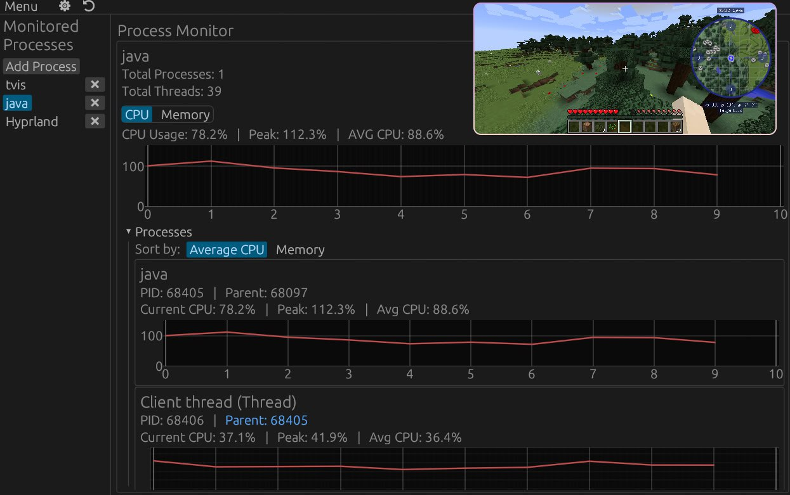

# TVIS 

<div align="center">

[](LICENSE-MIT)
[](https://www.rust-lang.org/)
[](https://www.egui.rs/)

A process monitoring tool that helps you track and analyze specific processes in real-time.



</div>

## ✨ Features

- **Real-time Monitoring** - Track CPU and memory usage with live-updating graphs
- **Customizable UI** - Adjust update intervals, history length, and visual settings
- **Cross-platform** - Works on Windows, Linux, and macOS

## 🚀 Getting Started

### Installation

#### Option 1: Download Binary 
You can download the pre-built binary for your platform from the [Releases](https://github.com/charl1e7/tvis/releases) page.


#### Option 2: Build from Source
If you prefer to build from source or need a specific configuration:

```bash
git clone https://github.com/charl1e7/tvis.git
cd tvis
cargo build --release

# The binary will be available at ./target/release/
```

## 🤝 Contributing

Contributions are welcome! 

## 📝 License

This project is licensed under the MIT License - see the [LICENSE-MIT](LICENSE-MIT) file for details.